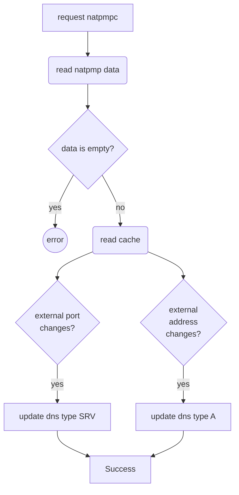

```mermaid
flowchart TD
    A[request natpmpc] --> B(read natpmp data)
    B --> C{data is empty?}
    C -->|yes| D((error))
    C -->|no| E(read cache)
    E --> F{"external 
            address 
            changes?"}
    F --> |yes| G[update dns type A]
    E --> H{"external port 
    changes?"}
    H --> |yes| J[update dns type SRV]
    J --> K
    G --> K[Success]
```
