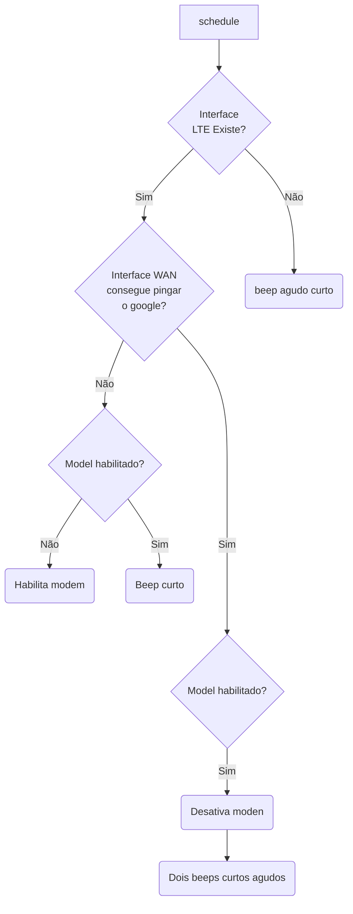

[Guia de como usar o script](https://linuxbasic.net/d/16-usando-4g-no-roteador-mikrotik-como-failover)

Fluxograma

```mermaid
flowchart
  A["schedule"] --> 
  C1{"Interface 
    LTE Existe?"}
  C1 -->|"Sim"| C2{"Interface WAN
                    consegue pingar
                    o google?"}
  C1 -->|"Não"| B("beep agudo curto")
  C2 -->|"Não"| C3{"Model habilitado?"}
  C3 -->|"Não"| C("Habilita modem")
  C3 -->|"Sim"| D("Beep curto")
  C2 ---->|"Sim"| C4{"Model habilitado?"}
  C4 -->|"Sim"| E("Desativa moden") --> F("Dois beeps curtos agudos")
```